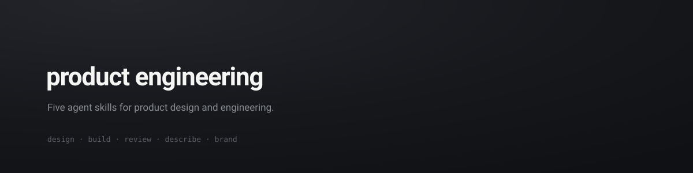
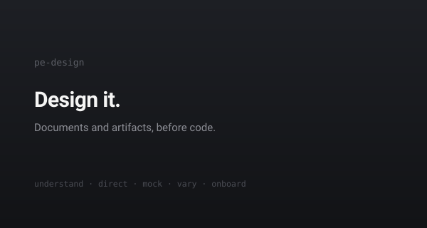
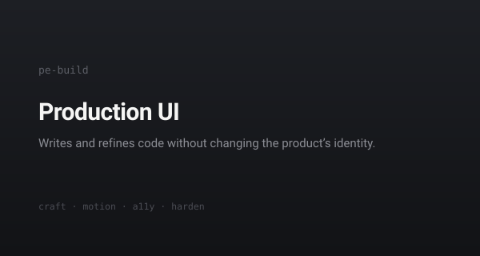
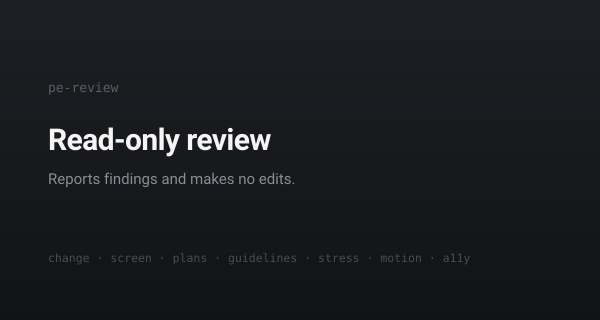
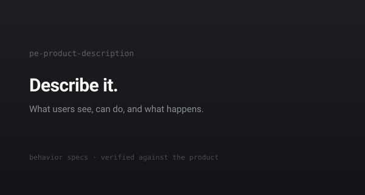
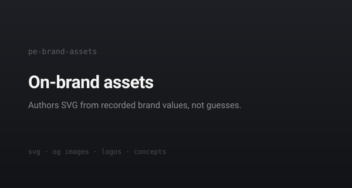
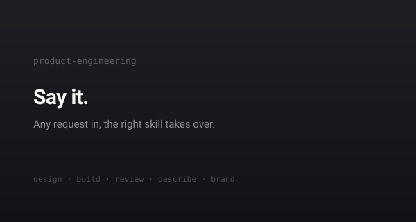
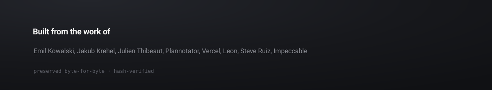

# product-engineering

Five agent skills covering the end-to-end product design process. Converged from
the [best published design-engineering skills](#provenance-and-integrity), with the
source prose preserved.

```bash
npx skills add backnotprop/product-engineering
```

## The skills

<p>
  <a href="skills/pe-design"></a>
  <a href="skills/pe-build"></a>
</p>
<p>
  <a href="skills/pe-review"></a>
  <a href="skills/pe-product-description"></a>
</p>
<p>
  <a href="skills/pe-brand-assets"></a>
  <a href="skills/product-engineering"></a>
</p>

<details>
<summary><b>Examples — what to say, what you get</b></summary>
<br>

| You say | You get |
| --- | --- |
| "Document our design system" | `pe-design` writes `PRODUCT.md` + `DESIGN.md` from repo evidence, or from a public URL |
| "How should this look and feel?" | `pe-design` derives a creative direction from your subject |
| "Wireframe the settings flow" | `pe-design` builds self-contained HTML, wireframe through prototype |
| "Show me three takes on this card" | `pe-design` renders real variants behind a picker in your page |
| "Build the pricing card" · "polish this" | `pe-build` writes production code at the craft bar |
| "Animate the drawer" · "this feels janky" | `pe-build`, motion mode |
| "Get this ready for production" | `pe-build` hardens: data extremes, failure states, devices, metadata |
| "Review my PR" | `pe-review`, diff-scoped and read-only |
| "Audit the app, give me a roadmap" | `pe-review` emits plans another agent can execute |
| "Write a product description for the editor" | `pe-product-description` builds a verified behavior spec |
| "Make an SVG header image for this post" | `pe-brand-assets` authors it from your recorded brand values |

</details>

| Skill | What it does |
| --- | --- |
| [`product-engineering`](skills/product-engineering) | The router: say "product engineering, ..." and it dispatches to the right skill below |
| [`pe-design`](skills/pe-design) | Product and design-system context (`PRODUCT.md`, `DESIGN.md`), creative direction, HTML wireframes and prototypes, UI variants, onboarding flows |
| [`pe-build`](skills/pe-build) | Production UI code: component craft, animation and gestures, accessibility, production hardening |
| [`pe-review`](skills/pe-review) | Read-only UI review: PR/diff review, screen critique, audits with executable plans, guidelines checks, stress tests |
| [`pe-product-description`](skills/pe-product-description) | Behavior specs: documents what users see and do, verified against the running product |
| [`pe-brand-assets`](skills/pe-brand-assets) | On-brand SVG assets: illustrations, social/OG images, logo work, from recorded brand values |

## Provenance and integrity

Most of this kit is other authors' work, carried byte-for-byte: every vendored file
is pinned to an upstream commit and hash-locked in `foundry/MANIFEST.json`, and CI
fails if a single character drifts. Recorded cuts live as patches beside pristine
copies; where sources disagreed, the ruling is written down once in a ledger; a
weekly watcher compares every pin against upstream and opens an issue when an author
improves something we carry.

The machinery, runbooks, and per-skill receipts live in [`foundry/`](foundry/).
Attribution is in [`NOTICE`](NOTICE). The animations.dev course pack is not
distributed here — owners layer it in locally via `foundry/scripts/course-dropin.sh`.



## License

Apache-2.0 for this repository's own work; vendored files remain under their
authors' licenses, with per-file provenance in `foundry/MANIFEST.json`.
